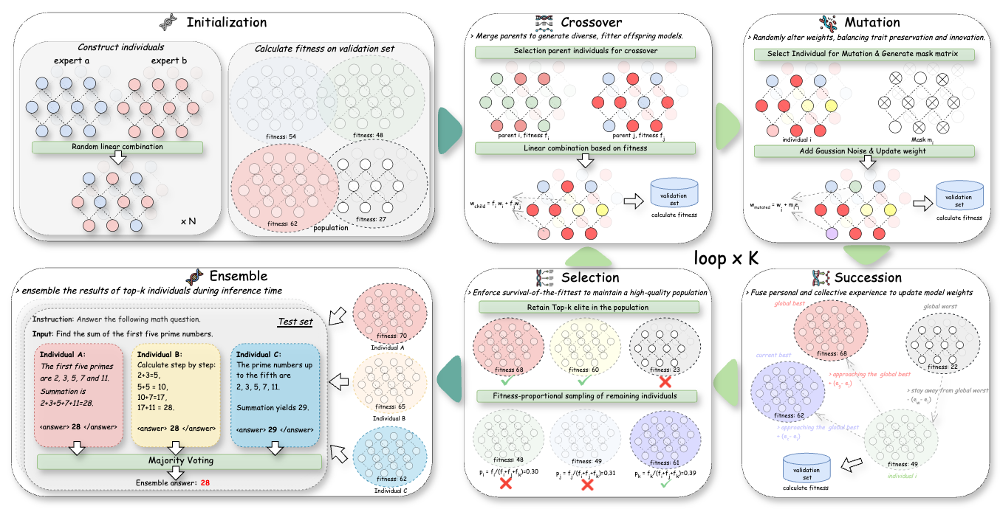

# GENOME(+)

> **GENOME(+)** is a framework for population-based evolution of Large Language Models (LLMs), inspired by natural evolution. Starting with a population of parent LLMs, the framework enables model evolution through five key operations:

### Key Operations
- **Crossover**: Merges weights of different parent LLMs to create offspring
- **Mutation**: Introduces controlled random changes to foster diversity
- **Selection**: Prioritizes high-performing models
- **Succession**: Transfers learned experience from parents to offspring
- **Ensemble**: Combines the strengths of multiple evolved models for robust predictions

---

🌟 **Key Features**:
- **Rapid adaptation** with only 200 samples per new task
- **No gradients** required for evolution
- **Up to 54.8% accuracy gains** over initial population (on DROP dataset)
- **Effective scaling** with populations up to 40 LLMs
- **Zero-shot generalization** to unseen tasks
- **Runs on a single 4090 GPU** (24GB memory)



## 📦 Installation

1. Clone the repository:

```bash
git clone https://github.com/yourusername/GENOME.git
cd GENOME
```

2. Install dependencies:

```bash
pip install -r requirements.txt
```

## 🚀 Usage

### GENOME

```bash
python run_genome.py \
    --tasks mmlu gsm8k arc_c \
    --task_weights 0.4 0.3 0.3 \
    --model_path meta-llama/Meta-Llama-3-8B-Instruct \
    --lora_dir lora_adapters \
    --combine_method ties \
    --population_size 30 \
    --max_iter 50
```

## 📁 Project Structure

```
GENOME/
├── src/                    # Source code
│   ├── genome/            # Genome optimization algorithms
│   ├── evaluate/          # Task evaluators (MMLU, GSM8K, etc.)
│   ├── base/              # Base classes and configurations
│   └── analysis/          # Analysis and visualization tools
├── scripts/               # Utility scripts
├── config/               # Configuration files
├── datas/                # Datasets
├── run_genome.py           # Genome algorithm entry
```

## 🔧 Extension Guide

### Adding New Evaluators

1. Create a new evaluator class in `src/evaluate`:

```python
from src.evaluate.eval import Evaluator, Method, Split
from typing import Dict, List

class NewTaskEvaluator(Evaluator):
    def __init__(self):
        super().__init__()
        self.data = {}
    
    def load_data(self, split: str):
        """Load dataset for specific split
        Args:
            split: One of 'train', 'valid', 'test', 'full'
        """
        data_path = f"datas/new_task/{split}.jsonl"
        self.data[split] = self.load_jsonl(data_path)
    
    def api_evaluate(self, client: 'OpenAI', **kwargs) -> float:
        """Evaluate using OpenAI API interface
        Args:
            client: OpenAI client instance
            **kwargs: Additional parameters
        Returns:
            float: Evaluation score
        """
        # Implement API-based evaluation
        return score
    
    def local_evaluate(self, model: 'LLM', **kwargs) -> float:
        """Evaluate using local vLLM model
        Args:
            model: vLLM model instance
            **kwargs: Additional parameters
        Returns:
            float: Evaluation score
        """
        # Implement local model evaluation
        return score
```

2. Register the new evaluator in `src/evaluate/factory.py`:

```python
from enum import Enum
from .new_task_evaluator import NewTaskEvaluator

class Benchmark(Enum):
    # ... existing benchmarks ...
    NEW_TASK = "new_task"  # Add new benchmark

class EvaluatorFactory:
    def get_evaluator(self, task: str):
        if isinstance(task, str):
            task = Benchmark(task.lower())
            
        if not isinstance(task, Benchmark):
            raise TypeError(f"Task must be a string or Benchmark enum, got {type(task)}")
            
        # ... existing evaluators ...
        elif task == Benchmark.NEW_TASK:
            return NewTaskEvaluator()
        else:
            raise ValueError(f"Evaluator for task {task} not found.")
```


### Adding New Methods

1. Create a new method configuration class in `src/base`:

```python
from src.base.base_config import BaseConfig

class NewMethodConfig(BaseConfig):
    def __init__(self, **kwargs):
        super().__init__(**kwargs)
        # Add method-specific configuration parameters
        
    def validate(self):
        """Validate configuration parameters"""
        super().validate()
        # Add method-specific validation
```

2. Create a new method class in `src`:

```python
from src.base.base_method import BaseMethod

class NewMethod(BaseMethod):
    def __init__(self, config: NewMethodConfig):
        self.config = config
        self.config.validate()
        # Initialize method-specific properties
        
    def search(self):
        """Implement search logic"""
        # Implement core optimization method logic
```

3. Create a run script `run_new_method.py`:

```python
import argparse
from src.new_method import NewMethod, NewMethodConfig

def parse_args():
    parser = argparse.ArgumentParser()
    # Add command line arguments
    return parser.parse_args()

def main():
    args = parse_args()
    config = NewMethodConfig(**vars(args))
    method = NewMethod(config)
    method.search()

if __name__ == "__main__":
    main()
```

### Using New Components

1. Using the new evaluator:

```bash
python run_modelswarms.py \
    --tasks new_task \
    --task_weights 1.0 \
    # ... other parameters
```

2. Using the new optimization method:

```bash
python run_new_method.py \
    --model_path meta-llama/Meta-Llama-3-8B-Instruct \
    --lora_dir lora_adapters \
    --task mmlu \
    # ... method-specific parameters
```

## 📝 Notes

- Ensure sufficient GPU resources for model deployment
- Recommended to use vLLM for efficient inference
- Performance can be optimized through parameter tuning


## 📄 License

This project is licensed under the MIT License - see the [LICENSE](LICENSE) file for details.
